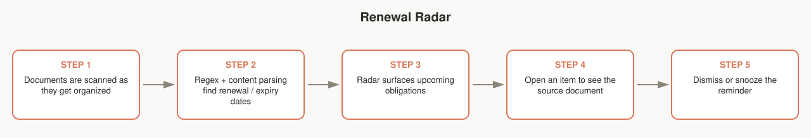

# Renewal Radar

Surfaces subscription and contract renewal dates buried in your documents, so you stop finding out about an auto-renewal after it's charged.

## Workflow

1. Documents get scanned as they pass through organizing (contracts, invoices, subscription confirmations, etc.).
2. Regex and content parsing look for renewal/expiry/cancellation-deadline dates.
3. Radar surfaces anything coming up.
4. Open an item to jump to the source document.
5. Dismiss it, or snooze it for a reminder closer to the date.

## Notes for testers

- Try documents with dates written differently ("renews July 21", "07/21/2026", "expires in 30 days from purchase") and see what Radar catches vs. misses.
- False positives (a random date flagged as a renewal) are more useful to report than false negatives — this is regex-based detection, so edge phrasing is expected to slip through occasionally.
