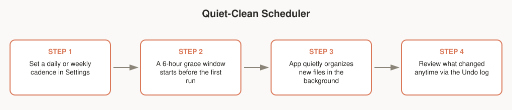

# Quiet-Clean Scheduler & Tray Quick-Drop

Two ways to keep folders tidy without running the full app each time.

## Quiet-clean scheduler

Runs organizing quietly in the background on a cadence you set — daily or weekly — instead of you remembering to do it manually.

1. Set a daily or weekly cadence in Settings.
2. A 6-hour grace window starts before the first scheduled run, so a run doesn't fire the moment you set it up.
3. The app quietly organizes new files in the background on that cadence.
4. Review what changed anytime via the Undo log — background runs are just as reversible as manual ones.

## Tray & quick-drop window

A persistent tray icon with a small drop window for instant filing, without opening the main app.

1. Open the tray quick-drop window.
2. Drag a file onto it.
3. The file is instantly classified and filed.
4. The tray shows a confirmation.

## Notes for testers

- Confirm the scheduler actually respects the grace window and cadence you set (don't expect an immediate run right after configuring it).
- Quick-drop should work for drags from Finder/Explorer and should never leave a file half-moved if you drag mid-operation.
