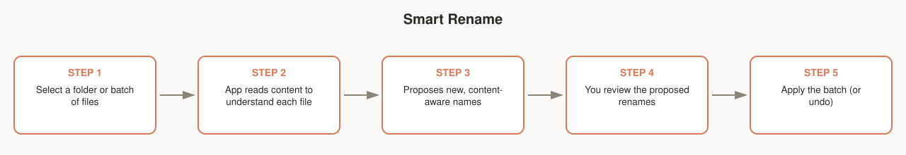

# Smart Rename

Batch-renames a folder of inconsistently-named files based on what's actually in them, instead of leaving you with `IMG_4821.jpg`, `Scan_003.pdf`, `Untitled-2.docx`.

## Workflow

1. Select a folder or a batch of files.
2. The app reads each file's content to understand what it is.
3. It proposes new, content-aware names for the batch.
4. You review every proposed rename before anything happens — nothing is renamed silently.
5. Apply the batch, or undo afterward if a name doesn't fit.

## Notes for testers

- Check the review step carefully — this is the one place a bad classification would be most visible before it touches your files.
- Try it on files near the 255-character filename limit; the app should truncate its own additions (date prefixes, tags) rather than fail (see [EDGE_CASES.md](../../EDGE_CASES.md), case 3).
- Renaming should never change file content — only the name.
