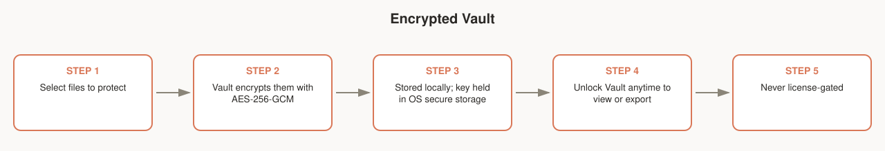

# Encrypted Vault

Local, encrypted storage for files you don't want floating around in a regular folder — AES-256-GCM, with the key held via the OS's secure storage (macOS Keychain / Windows Credential Manager, through Electron's `safeStorage`).

Vault is **not license-gated** — it works during the free trial and after, license or no license.

## Workflow

1. Select files to protect.
2. Vault encrypts them with AES-256-GCM.
3. Encrypted files are stored locally; the key is held in OS secure storage, not in a plain config file.
4. Unlock Vault anytime to view or export the originals.
5. Vault access is never gated behind a license or paywall.

## Notes for testers

- Confirm a file inside Vault isn't readable as plaintext anywhere on disk (check the raw stored file, not just the app UI).
- Confirm Vault still works with no license/after the trial ends — this should never be blocked.
